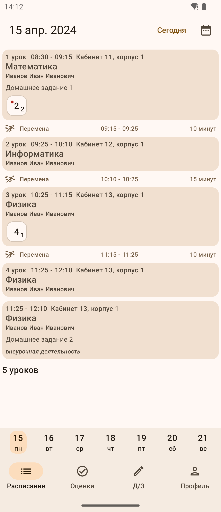
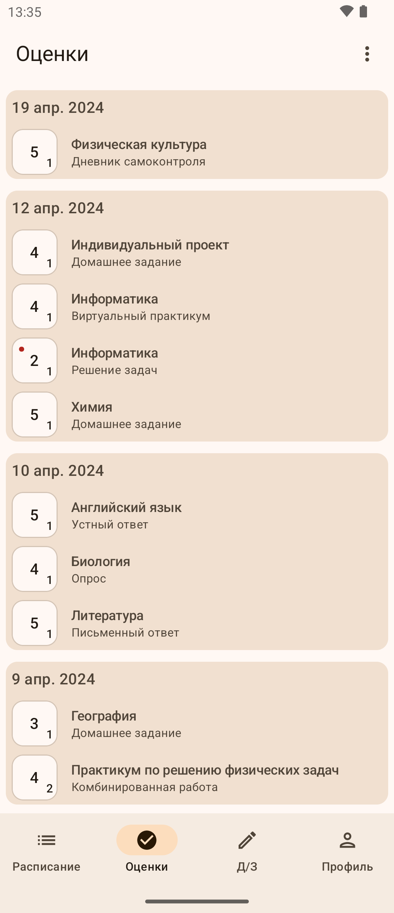
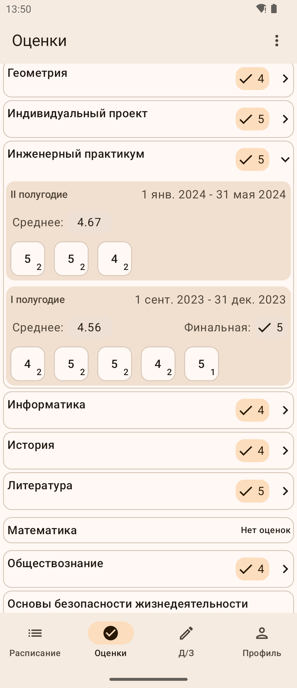
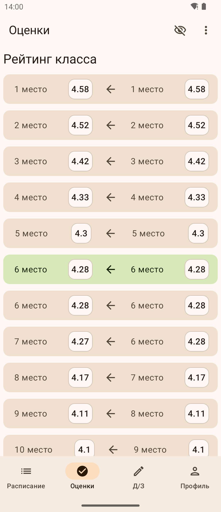
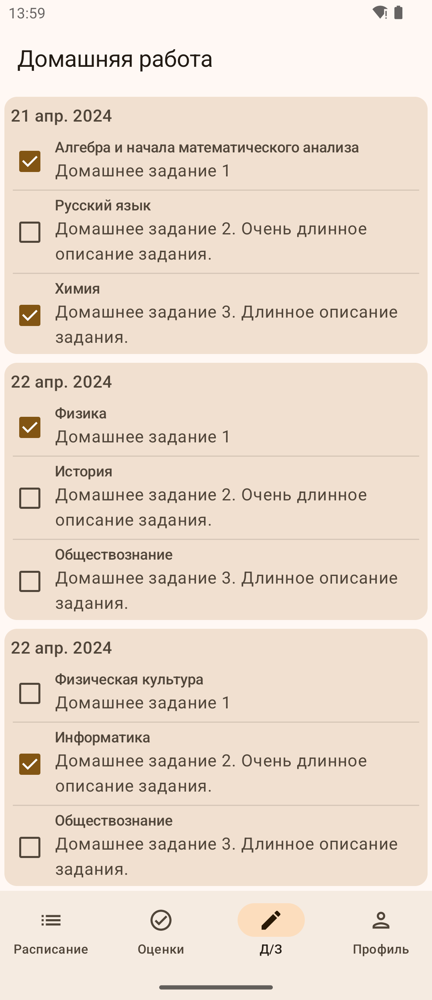
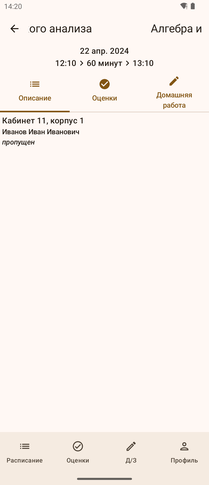
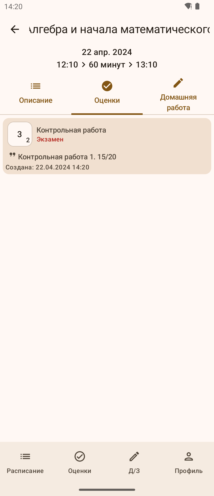

# libremesh
open source android client for МЭШ(Moscow Electronic School). native(official app written in React Native), uses Jetpack Compose. android 8+

> [!warning]
> this app is currently WIP. so there are a lot of flaws, unimplemented features and bugs. if you encounter some, please open an issue

### screenshots

### installation
- latest pre-built [release](https://github.com/x3lfyn/libremesh/releases/latest)
- build from source using android studio

### known flaws
- login occurs through WebView in app. if you have any security concerns, check source code(it is pretty shitty)